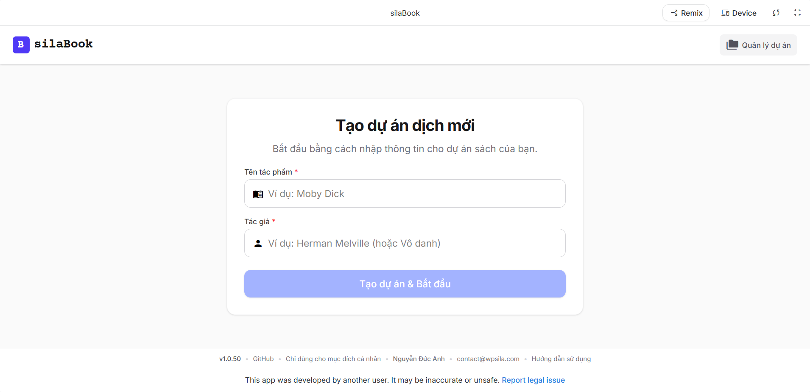
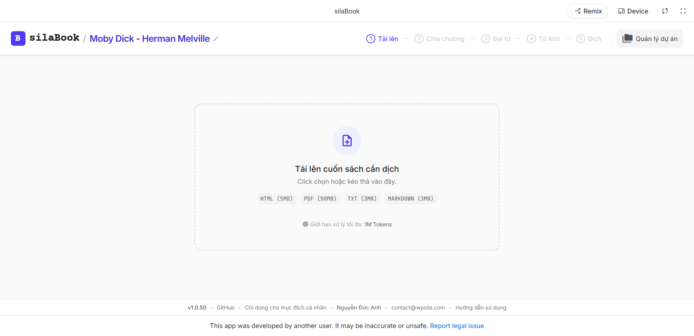
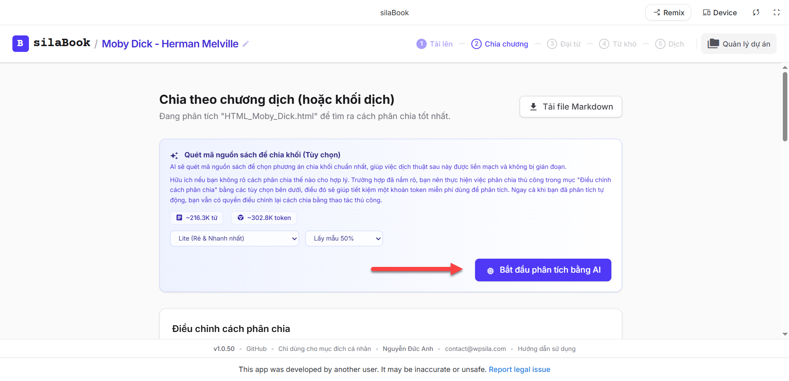
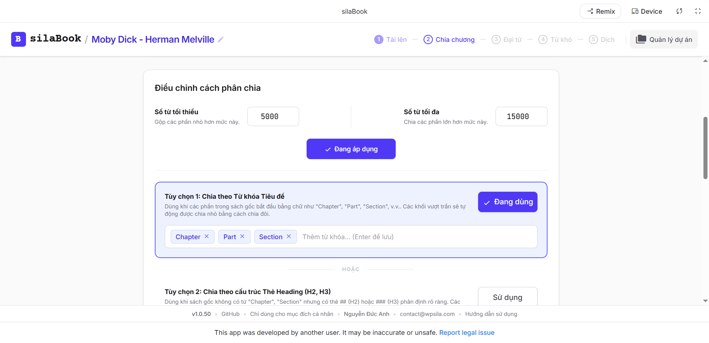
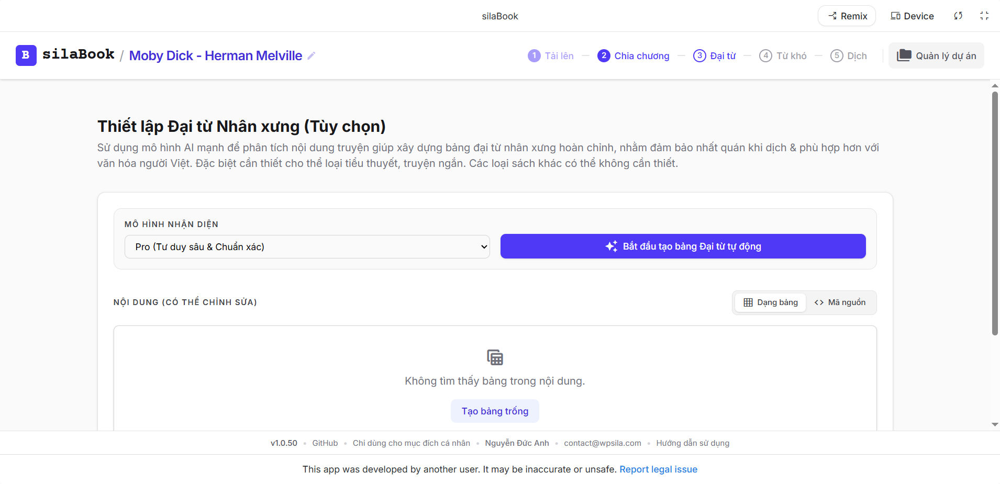
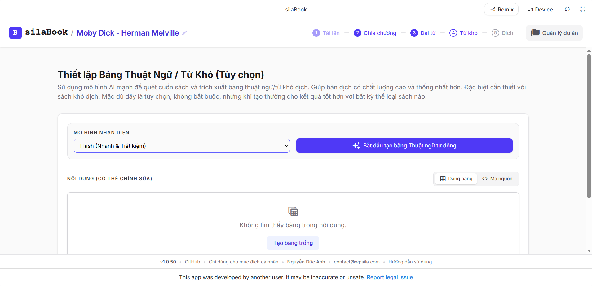
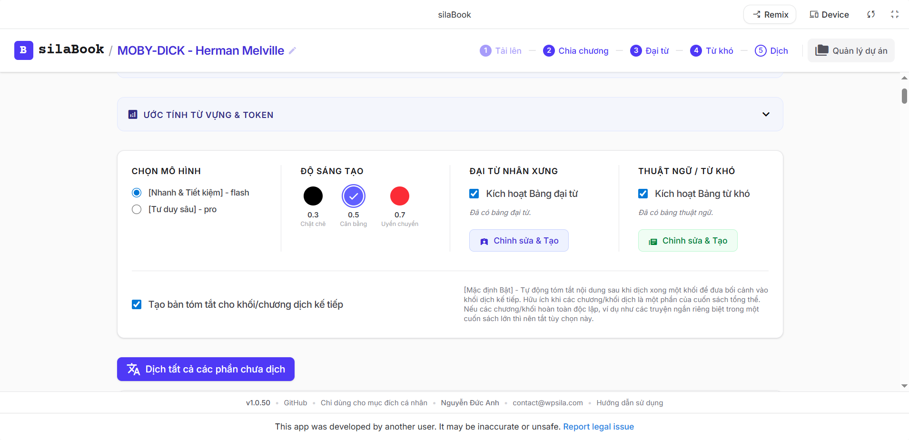
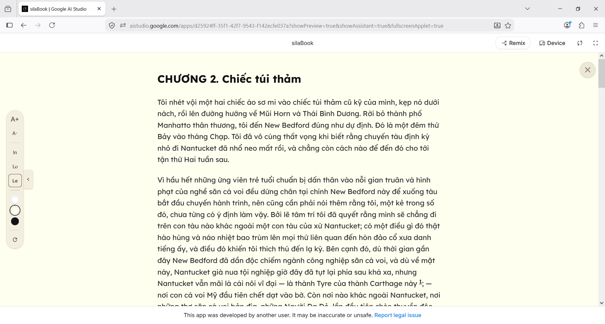
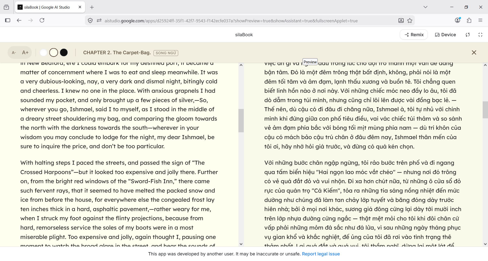

# silaBook
Công cụ dịch sách từ tiếng Anh sang tiếng Việt bằng Gemini. **Dự án đang trong giai đoạn phát triển và thử nghiệm**.

Chương trình sử dụng SI & Prompt từ dự án này: https://github.com/kiencang/SI-Prompt-Book-EV-Translate (**v1.0.27**).

## Hướng dẫn sử dụng

  
    <em>Bước 1: Tạo dự án: Ở đây các bạn cần nhập chính xác tên sách & tác giả. Thông tin này quan trọng, vì sách (nhất là kinh điển) thường có thông tin rất đầy đủ trên mạng, cung cấp chính xác thông tin giúp công cụ dịch tốt hơn.</em>

  
    <em>Bước 2: Tải sách lên: Bạn tải sách gốc tiếng Anh lên. Hiện công cụ hỗ trợ 4 định dạng là HTML, PDF, TXT & Markdown.</em>

Định dạng khuyến khích là HTML. PDF cũng ổn nhưng sẽ mất thêm chút thời gian để phân tích. Và các sách đang còn bản quyền thường bị AI từ chối phân tích. Các định dạng khác thì không bị như vậy.

  
    <em>Bước 3: Chia chương/khối dịch: Ứng dụng cần chia cuốn sách ra thành các chương/khối để dịch lần lượt. Ở đây bạn sẽ có các tùy chọn chia cuốn sách theo cách thức nào.</em>

  Có 2 cách:
- Nhờ AI chia: sử dụng tín năng này nếu bạn không rõ cấu trúc của cuốn sách, không biết chia thế nào cho hợp lý.
- Chia thủ công bằng các lựa chọn: bạn biết cấu trúc cuốn sách cơ bản thế nào, và chọn phương pháp phù hợp. Có 3 cách chia cơ bản:
    + Chia theo chương: công cụ sẽ tự động quét các từ khóa như `chapter` để tách sách thành các chương.
    + Chia theo các tiêu đề lớn: nếu sách không phân thành các chương mà dùng các tiêu đề lớn thì nên chọn cách này để chia
    + Chia đều tự động: nếu 2 cách trên đều bó tay, thì bạn áp dụng cách này, nó sẽ phân sách ra làm các phần nhỏ hơn dựa theo các dấu xuống dòng. Đây là cách tệ nhất để chia sách, chỉ dùng nếu 2 cách trên không áp dụng được.
   + Chia thủ công có tùy chọn `Số từ tối thiểu` & `Số từ tối đa`: cái này dùng để áp ngưỡng phân chia. Mỗi chương/khối sẽ bắt buộc phải nằm trong ngưỡng này. Bạn cũng nên điều chỉnh để xem sách chia thế nào. Ý tưởng cơ bản là: nếu chia sách quá vụn hoặc quá lớn thì đều khó dịch hơn.

  
    <em>Chia sách theo cách thủ công</em>

  
    <em>Bước 4: Tạo đại từ xưng hô: Đại từ xưng hô có thể nói là phần khác biệt nhất giữa tiếng Anh & tiếng Việt. Tiếng Việt có đại từ xưng hô rất phức tạp, phụ thuộc vào tuổi, giới tính, vai vế, chức vụ & cả tâm trạng!</em>

Phần này đặc biệt quan trọng cho thể loại truyện ngắn, tiểu thuyết. Các dạng sách phi hư cấu có thể không cần thiết (bấm button `Bỏ qua phần này` nếu không muốn tạo).
  
Bạn chỉ việc nhấn button, công cụ sẽ tự quét toàn bộ cuốn sách và tạo bảng đại từ đầy đủ. Vì đại từ rất quan trọng, bạn nên chọn model AI cao nhất để phân tích.

  
    <em>Bước 5: Tạo danh sách từ khó/thuật ngữ: hầu hết các sách đều có những từ khó dịch, nên bước này bạn nên làm với bất kỳ thể loại sách nào.</em>

Model chọn để phân tích lý tưởng nhất vẫn là model cao nhất (Pro). Tuy nhiên sách rất tốn dữ liệu nên người dùng miễn phí để không bị gián đoạn phân tích nên dùng model tầm trung (Flash) để làm.  

  
    <em>Bước 6: Dịch: Tiến hành dịch chính thức.</em>

Sau khi có các nguyên liệu thô ở các bước trước, ứng dụng sẵn sàng dịch cả cuốn sách.
Các thiết lập mặc định đủ tốt trong phần lớn trường hợp. Bạn chỉ việc nhất button `Dịch tất cả` (để dịch cả cuốn sách) hoặc `Dịch riêng phần này` (để dịch một chương/khối cụ thể).
  
Nên chọn model cao nhất ở bước này. Tuy nhiên nếu muốn dịch nhanh hơn, không bị gián đoạn, có thể dùng model Flash.
  
Thường để dịch nguyên một cuốn sách ứng dụng cần 1 - 2 tiếng. Lý do là vì nó dịch theo kiểu tuần tự để đảm bảo bối cảnh tốt nhất cho các phần tiếp theo.

  
    <em>Đọc bản dịch ngay trong ứng dụng</em>

  
    <em>Đọc song ngữ với việc so sánh dễ dàng 2 khối dịch tương ứng nhau để tiện đối chiếu</em>

## Tuyên bố từ chối trách nhiệm
Công cụ này có thể được sử dụng cho mục đích nghiên cứu và học tập cá nhân.

silaBook cũng như người phát triển nó không đưa ra bất kỳ bảo đảm rõ ràng hay ngụ ý nào, cũng như không tuyên bố rằng công cụ sẽ vận hành hoàn hảo, chính xác hoặc cập nhật. Người phát triển sẽ không chịu trách nhiệm cho bất kỳ tổn thất hay thiệt hại nào phát sinh trực tiếp hoặc gián tiếp liên quan đến hoặc phát sinh từ việc sử dụng công cụ này.

